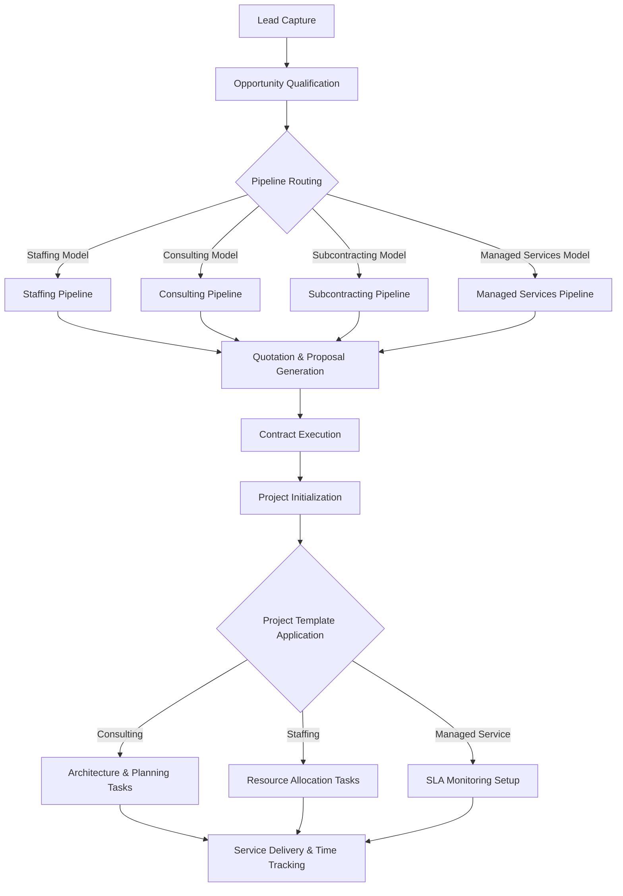

# IntraStack CRM Customization (Odoo 17)

## Overview.
This repository contains a comprehensive custom Odoo 17 Enterprise Resource Planning (ERP) and Customer Relationship Management (CRM) module developed for IntraStack Solutions. The module extends standard Odoo functionalities to support complex, multi-faceted business operations including staffing, consulting, subcontracting, and managed services.

## Core Capabilities
- Pipeline Management: Configures 4 distinct CRM pipelines with 26 specialized stages tailored for different service delivery models.
- Data Modeling: Introduces custom fields on opportunity records (Deal Classification, Service Category, Urgency, Source, Value, Decision Maker) and implements relationship categorization tags.
- Automated Workflows: Incorporates automated activity rules to streamline business processes and enforce sales protocols.
- Templates Integration: Pre-configures project templates (Staffing, Consulting, Managed Service) and sales quotation templates (Rate Card, Statement of Work, Managed Service Contract) to standardize service delivery.
- Analytics & Reporting: Includes saved filter views for executive dashboard reporting and system monitoring.
- Demo Data Initialization: Pre-packaged with realistic demo data for seamless environment testing and validation.

## System Workflow



## Technical Stack
- Framework: Odoo 17 Community Edition
- Backend Core: Python 3
- Data Structures & User Interface: XML
- Automation: Shell Scripting (Bash) for deployment pipelines

## Deployment Guide
1. Navigate to your Odoo custom addons directory.
2. Clone this repository into the addons directory:
   ```bash
   git clone https://github.com/khiemdztv/intrastack_crm_customize_project.git intrastack_crm
   ```
3. Restart the Odoo service environment to detect the new module.
4. Access the Odoo instance with Administrator privileges.
5. Activate "Developer Mode" in the settings.
6. Navigate to the Apps menu and select "Update Apps List".
7. Search for "IntraStack CRM Platform" and execute the installation.

## License
This project is released under the LGPL-3 License.
