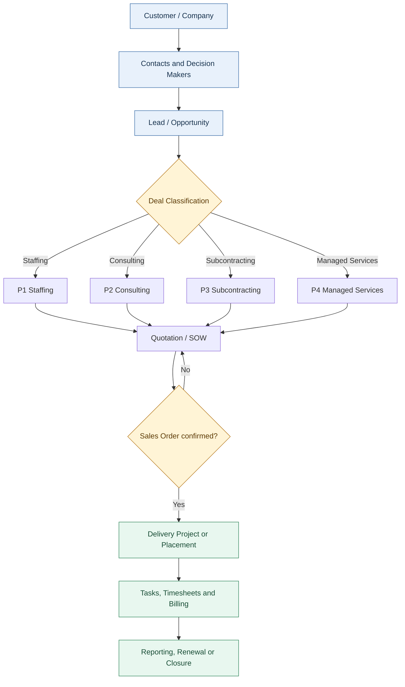
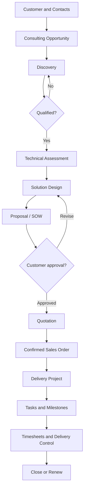
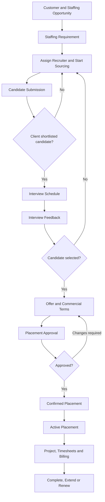
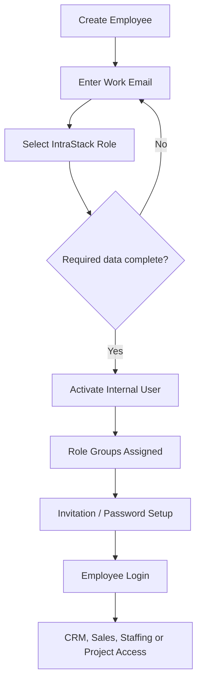
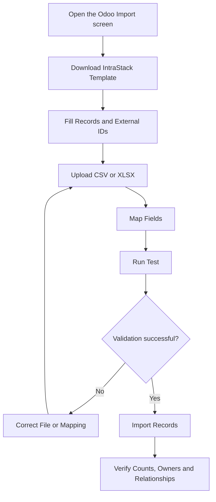

# IntraStack CRM Platform for Odoo 17 Community

IntraStack CRM Platform is a custom Odoo 17 Community module that connects the
customer database, four CRM service pipelines, Sales, staffing operations,
employee access and project delivery in one controlled workflow.

Current module release: `17.0.2.2.0`

## Capabilities

- Shared customer, company, contact, candidate and recruiter/vendor database.
- CSV/XLSX imports with downloadable IntraStack templates on Odoo Import screens.
- Four server-routed CRM pipelines: Staffing, Consulting, Subcontracting and Managed Services.
- Opportunity classification, service category, urgency, source, expected value and decision-maker fields.
- Contract start, end and renewal-review dates with validation.
- Classification-based quotation templates and service products.
- CRM to quotation to confirmed Sales Order to delivery-project traceability.
- Staffing Requirements, Candidate Submissions, Interview Schedule and Placements.
- Resume, availability, bill/cost rate and gross-margin tracking.
- Role-driven internal employee activation for Sales, Recruitment, Projects and Timesheets.
- Automated follow-up activities and management filters.
- Production-safe Docker Compose deployment with database and filestore backup.

## Workflow and Process Charts

### Platform Operating Model


```mermaid
flowchart TD
    A["Customer / Company"] --> B["Contacts and Decision Makers"]
    B --> C["Lead / Opportunity"]
    C --> D{"Deal Classification"}

    D -->|Staffing| P1["P1 Staffing"]
    D -->|Consulting| P2["P2 Consulting"]
    D -->|Subcontracting| P3["P3 Subcontracting"]
    D -->|Managed Services| P4["P4 Managed Services"]

    P1 --> E["Quotation / SOW"]
    P2 --> E
    P3 --> E
    P4 --> E

    E --> F{"Sales Order confirmed?"}
    F -->|No| E
    F -->|Yes| G["Delivery Project or Placement"]
    G --> H["Tasks, Timesheets and Billing"]
    H --> I["Reporting, Renewal or Closure"]

    classDef source fill:#e8f1fb,stroke:#3b6ea8,color:#16324f;
    classDef route fill:#fff4d6,stroke:#b7791f,color:#5f3b00;
    classDef delivery fill:#e8f7ef,stroke:#2f855a,color:#174d35;
    class A,B,C source;
    class D,F route;
    class G,H,I delivery;
```

### Consulting and Cloud Transformation


```mermaid
flowchart TD
    A["Customer and Contacts"] --> B["Consulting Opportunity"]
    B --> C["Discovery"]
    C --> D{"Qualified?"}
    D -->|No| C
    D -->|Yes| E["Technical Assessment"]
    E --> F["Solution Design"]
    F --> G["Proposal / SOW"]
    G --> H{"Customer approval?"}
    H -->|Revise| F
    H -->|Approved| I["Quotation"]
    I --> J["Confirmed Sales Order"]
    J --> K["Delivery Project"]
    K --> L["Tasks and Milestones"]
    L --> M["Timesheets and Delivery Control"]
    M --> N["Close or Renew"]
```

### Staffing Delivery


```mermaid
flowchart TD
    A["Customer and Staffing Opportunity"] --> B["Staffing Requirement"]
    B --> C["Assign Recruiter and Start Sourcing"]
    C --> D["Candidate Submission"]
    D --> E{"Client shortlisted candidate?"}
    E -->|No| C
    E -->|Yes| F["Interview Schedule"]
    F --> G["Interview Feedback"]
    G --> H{"Candidate selected?"}
    H -->|No| C
    H -->|Yes| I["Offer and Commercial Terms"]
    I --> J["Placement Approval"]
    J --> K{"Approved?"}
    K -->|Changes required| I
    K -->|Yes| L["Confirmed Placement"]
    L --> M["Active Placement"]
    M --> N["Project, Timesheets and Billing"]
    N --> O["Complete, Extend or Renew"]
```

### Employee Account Activation


```mermaid
flowchart TD
    A["Create Employee"] --> B["Enter Work Email"]
    B --> C["Select IntraStack Role"]
    C --> D{"Required data complete?"}
    D -->|No| B
    D -->|Yes| E["Activate Internal User"]
    E --> F["Role Groups Assigned"]
    F --> G["Invitation / Password Setup"]
    G --> H["Employee Login"]
    H --> I["CRM, Sales, Staffing or Project Access"]
```

### CSV/XLSX Import Process


```mermaid
flowchart TD
    A["Open the Odoo Import screen"] --> B["Download IntraStack Template"]
    B --> C["Fill Records and External IDs"]
    C --> D["Upload CSV or XLSX"]
    D --> E["Map Fields"]
    E --> F["Run Test"]
    F --> G{"Validation successful?"}
    G -->|No| H["Correct File or Mapping"]
    H --> D
    G -->|Yes| I["Import Records"]
    I --> J["Verify Counts, Owners and Relationships"]
```

## CRM Pipelines

| Pipeline | Stages |
|---|---|
| P1 Staffing | New Requirement, Sourcing, Submitted, Interviews, Offer, Closed Won, Active Billing, Renewal |
| P2 Consulting | Discovery, Qualification, Solution Design, Proposal, Negotiation, Closed Won, Delivery |
| P3 Subcontracting | Outreach, Vendor Qualification, Capability Review, Approved Vendor, Active Engagement |
| P4 Managed Services | Qualified Lead, Assessment, Proposal, Contract, Active Service, Renewal |

Changing `Deal Classification` automatically routes an opportunity to the
matching team and first stage. Server validations prevent a deal from remaining
in a stage belonging to another pipeline.

## Import Templates

The module adds downloadable templates to the `Need Help?` area of relevant
Odoo Import screens:

- Customer Companies
- Company Contacts
- Candidates
- Recruiter Vendors
- CRM Opportunities
- Employees and Roles
- Staffing Requirements
- Candidate Submissions
- Interview Schedule
- Staffing Placements
- Banks
- Contact Bank Accounts

Standalone copies and import-order guidance are available in [`templates/`](templates/)
and [`docs/CSV_IMPORT_GUIDE.md`](docs/CSV_IMPORT_GUIDE.md).

## Requirements

- Odoo 17 Community
- PostgreSQL 15 or another PostgreSQL version supported by Odoo 17
- Docker Engine with Docker Compose for the provided production deployment

The module depends on standard Community modules including CRM, Sales,
Projects, Timesheets, Employees, Contacts, Base Automation and Authentication
Signup. See [`intrastack_crm/__manifest__.py`](intrastack_crm/__manifest__.py)
for the authoritative dependency list.

## Install or Upgrade

Production installations must not load demo data.

```bash
odoo -d YOUR_DATABASE \
  -i intrastack_crm \
  --without-demo=all \
  --stop-after-init
```

Upgrade an existing database with:

```bash
odoo -d YOUR_DATABASE \
  -u intrastack_crm \
  --without-demo=all \
  --stop-after-init
```

Always back up both PostgreSQL and the Odoo filestore before an upgrade.

## Docker Deployment

The repository includes a Compose deployment and a guarded deployment script:

```bash
cd deploy
cp .env.example .env
chmod 600 .env
# Edit .env and replace every example secret.
docker compose pull
docker compose up -d db
./deploy.sh
```

The deployment script validates configuration, starts PostgreSQL, stops Odoo,
backs up the database and filestore, upgrades the module without demo data,
restarts Odoo and verifies the health endpoint.

See [`deploy/README.md`](deploy/README.md) for reverse proxy, TLS, websocket,
SMTP and backup requirements.

## Testing

Run module tests against a disposable Odoo database:

```bash
odoo -d intrastack_tests \
  -u intrastack_crm \
  --test-enable \
  --test-tags /intrastack_crm \
  --stop-after-init
```

The automated suite covers CRM routing and readiness, quotation/project
creation, Staffing workflows, employee access synchronization and downloadable
import templates. The current local validation completed with 30 tests and no
failures or errors.

## Documentation

- [End User and Workflow Guide v2.1](docs/IntraStack_CRM_End_User_Workflow_Guide_v2.1.pdf)
- [Guide HTML source](docs/IntraStack_CRM_End_User_Workflow_Guide.html)
- [CSV/XLSX Import Guide](docs/CSV_IMPORT_GUIDE.md)
- [BRD Traceability](docs/BRD_TRACEABILITY.md)
- [User Acceptance Test Checklist](docs/UAT_CHECKLIST.md)
- [Go-Live Checklist](docs/GO_LIVE_CHECKLIST.md)

The v2.1 guide contains current production screenshots, field-by-field operating
instructions and complete fictional Consulting and Staffing training scenarios.

## Repository Structure

```text
intrastack_crm/   Odoo addon, security, views, data, migrations and tests
deploy/           Docker Compose deployment and backup-aware upgrade script
docs/             BRD traceability, operations, UAT and end-user documentation
templates/        Clean CSV import templates and template pack
screenshots/      Images used by the end-user guide
```

## Production Boundaries

- Odoo 17 Community does not provide unattended subscription billing by default.
  Managed Services recurring invoices require an approved manual process or an
  evaluated OCA subscription module.
- Quotations, Sales Orders and Delivery Projects should be created through the
  integrated CRM workflow rather than imported as disconnected records.
- Never commit `.env`, database dumps, filestore archives, API tokens or real
  customer/candidate exports.

## License

LGPL-3. See the module manifest for license metadata.
